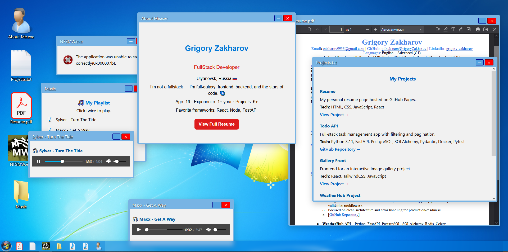

### 🪟 **windows7-resume-en**

An **interactive portfolio** styled like **Windows 7 desktop**, where each app window opens real content — projects, resume, music, and more.
This is the **English version** of my interactive resume built with **React + Vite**.



🌐 **Live Demo:** [grigoryzakharov.github.io/windows7-resume-en](https://grigoryzakharov.github.io/windows7-resume-en)

---

## 📁 Project Overview

This project recreates the nostalgic Windows 7 desktop experience — complete with draggable windows, icons, and a taskbar — to present my developer portfolio in a fun, interactive way.

Each icon opens a unique “window”:

* 💼 **Resume** – About me, education, and skills
* ⚙️ **Projects** – Links and descriptions of my works
* 🎵 **Music** – Interactive playlist
* 🖼️ **Gallery** – Showcase of screenshots and design elements
* 🌐 **Contacts** – Links to GitHub, LinkedIn, and Telegram

---

## 🧰 Tech Stack

* ⚛️ **React 18**
* ⚡ **Vite**
* 🎨 **CSS + Inline Styles**
* 🧩 **React Icons**
* 📦 **Node.js**
* 🚀 **GitHub Pages** (for deployment)

---

## 🖥️ Local Setup

Clone the repo and start the dev server:

```bash
git clone https://github.com/GrigoryZakharov/windows7-resume-en.git
cd windows7-resume-en
npm install
npm run dev
```

Then open [http://localhost:5173](http://localhost:5173) in your browser.

---

## 🏗️ Build & Deploy

To build the project for production:

```bash
npm run build
```

This will output your static files into the `docs/` folder (for GitHub Pages).

---

## 🌈 Features

✅ Windows 7-inspired desktop layout
✅ Animated icons & draggable windows
✅ Taskbar with window management
✅ Responsive & mobile-friendly
✅ Interactive content (music player, project viewer, etc.)

---

## 📸 Preview

*(You can add screenshots later if you want — example placeholders below)*


---

## 👨‍💻 Author

**Grigory Zakharov**
Full-Stack Developer (React / FastAPI)
📧 [zakharov9933@gmail.com](mailto:zakharov9933@gmail.com)
🐙 [GitHub](https://github.com/GrigoryZakharov)
💼 [LinkedIn](https://www.linkedin.com/in/grigory-zakharov-577561389/)
💬 [Telegram](https://t.me/ILoveTankiOnline)
